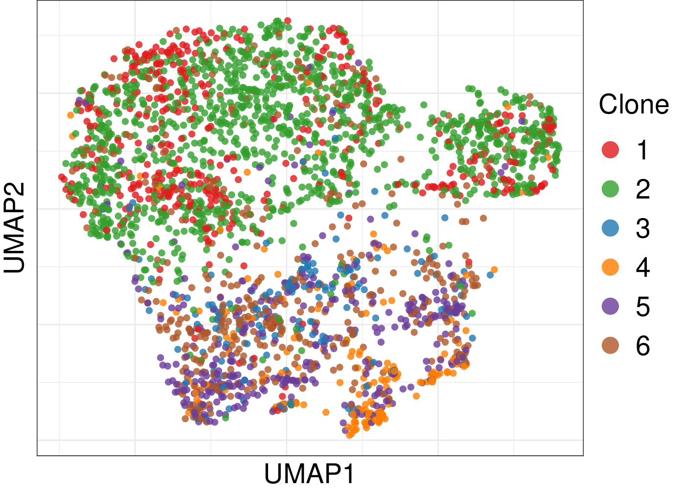

Alleloscope (Matched scDNA-seq and scATAC-seq)
================
Chi-Yun Wu, Zhang Lab, University of Pennsylvania

## Description
With matched scDNA-seq and scATAC-seq data, Alleloscope is able to integrate allele-specific copy number alterations (CNAs) (genomics) and chromatin accessibility (epigenetics). Based on allele-specific CNAs profiled in scDNA-seq data, a tumor lineage structure can be reconstructed with several subclones identified. Then each cells in scATAC-seq data can be confidently assigned to the detected subclones by matching multiple allele-specific CNAs detected independently from either scDNA-seq data or scATAC-seq data. This will facilitate dissection of the contributions of chromosomal instability and chromatin remodeling in tumor evolution.

For more information about the method, please check out the [github](https://github.com/seasoncloud/Alleloscope) and the [paper](https://doi.org/10.1101/2020.10.23.349407).
<br/>

## Prepare input files
The following are the input files for different steps.

1. A Standard vcf file with the SNP info. [EXAMPLE](https://github.com/seasoncloud/Alleloscope/blob/main/data-raw/SNU601/scDNA/var_all_sub.vcf)
* GATK HaplotypeCaller (https://gatk.broadinstitute.org/hc/en-us/articles/360037225632-HaplotypeCaller) is recommended to use to call germline SNPs from the standard bam files ([Example script](https://github.com/seasoncloud/Basic_CNV_SNV/blob/main/scripts/snv_calling_gatk.sh)). Other SNP calling tools such as BCFtools can also be used. 
* SNPs are recommended to be called from the bam file of the matched normal samples. Without matched normal samples, our results show that calling SNPs from the tumor/cellline sample itself can also work. 
<br/>
 
2. A tsv file with all cell barcodes. [EXAMPLE](https://github.com/seasoncloud/Alleloscope/blob/main/data-raw/SNU601/scDNA/barcodes_sub.tsv)
* Each row is a barcode indicating cell identity.
* The "barcodes.tsv" files are the standard outputs of the Cell Ranger software.
<br/>
 
3. SNP by cell (sparse) matrices for both reference allele and alternative alleles. [EXAMPLE](https://github.com/seasoncloud/Alleloscope/blob/main/data-raw/SNU601/scDNA/alt_all_sub.mtx) 
* For single-cell platforms using barcode technology with all reads in a single bam file, the VarTrix (https://github.com/10XGenomics/vartrix) tools can be used to generate SNP by cell matrices for both ref and alt alleles ([Example script](https://github.com/seasoncloud/Basic_CNV_SNV/blob/main/scripts/vartrix.sh)).
* For single-cell platforms with separate bam files, the two matrices can be directly generated from multi-sample vcf files.
* The information for each SNP should be in the vcf file, the labeling for each cell should be in the barcodes.tsv file (with the same order).
<br/>
  
4. Bin by cell (sparse) matrices for tumor samples. [EXAMPLE](https://github.com/seasoncloud/Alleloscope/blob/main/data-raw/SNU601/scDNA/tumor_sub.txt) 
* The values in the matrices represent total read counts for each cell in each bin.
* Row name format:"chr1-1-20000"; The order of the columns (Each column is a cell.) should be the same as that in the barcodes.tsv.
* For scATAC-seq data, peak by cell matrix can be converted to bin by cell matrix by summing up the signals or using standard fragments.tsv files (Cell Ranger output) ([Example script](https://github.com/seasoncloud/Basic_CNV_SNV/blob/main/scripts/Gen_bin_cell_atac.R)).
<br/>

5. An alleloscope object generated from matched scDNA-seq data. Tutorial for generating scDNA-seq object can be found [here](https://github.com/seasoncloud/Alleloscope/tree/main/samples/SNU601/scDNA).
<br/>

## Tutorial for matched scATAC-seq and scDNA-seq integration
* Here is an example application to the newly generated SNU601 scATAC-seq data and the matched scDNA-seq dataset from Andor et al., 2020.
<br/>

#### Step0. Load the input files

* In R, set up the environment and read common files
```
library(Alleloscope) # load the library
setwd("~/Alleloscope/") # set path to the github folder

dir_path <- "./samples/SNU601/scATAC/output/"; dir.create(dir_path) # set up output directory

data(centromere.GRCh38)
data(telomere.GRCh38)
size=read.table("data-raw/sizes.cellranger-GRCh38-1.0.0.txt", stringsAsFactors = F)
```

* Read example files
```
# SNP by cell matrices for ref and alt alleles
barcodes=read.table("data-raw/SNU601/scATAC/barcodes.tsv", sep='\t', stringsAsFactors = F, header=F)
alt_all=readMM("data-raw/SNU601/scATAC/alt_all.mtx")
ref_all=readMM("data-raw/SNU601/scATAC/ref_all.mtx")
var_all=read.table("data-raw/SNU601/scATAC/var_all.vcf", header = F, sep='\t', stringsAsFactors = F)

# bin by cell matrices for tumor and normal for segmentation
raw_counts=read.table('data-raw/SNU601/scATAC/chr200k_fragments_sub.txt', sep='\t', header=T, row.names = 1,stringsAsFactors = F)
# Without paired normal sample, use matched scDNA-seq result to help normalize coverge for scATAC-seq data.
```

* Load information from matched scDNA-seq to assist estimation.
```
Obj_scDNA=readRDS("data-raw/SNU601/scATAC/SNU601_dna.rds")
```
<br/>

#### Step1. Creating a Alleloscope object for the analysis

* First, create a Alleloscope obj
```
Obj=Createobj(alt_all =alt_all, ref_all = ref_all, var_all = var_all ,samplename='Sample', genome_assembly="GRCh38", dir_path=dir_path, barcodes=barcodes, size=size, assay='scATACseq')
```

* Filter out cells and SNPs with too few read counts
```
Obj_filtered=Matrix_filter(Obj=Obj, cell_filter=5, SNP_filter=5, centro=centromere.GRCh38, telo=telomere.GRCh38) 

# Since phasing information is estimated in the matched scDNA-seq dataset, 
# loose filter: cell_filter=5 and SNP_filter=5 can be used.  
# No further filter for extreme VAF values is needed.
```
<br/>

#### Step2. Segmentation results from matched scDNA-seq or WGS/WES

* Assign segments from DNA into the current object
```
Obj_filtered$seg_table_filtered=Obj_scDNA$seg_table_filtered
```
<br/>

#### Step3. Estimate cell major haplotype proportion for each region

* Estimate theta_hat of each cell for each region in the filtered segment table (seg_table_filtered).
```
Obj_filtered = Est_regions(Obj_filtered = Obj_filtered, max_nSNP = 30000, min_ncell = 20, phases = Obj_scDNA$rds_list, plot_stat = T, cont = TRUE)

# The phases for each SNP estimated from DNA sequencing data can help estimate the major haplotype proportion for each cell in scATAC-seq data. 
# Recommend max_nSNP <50000
# Regions without allelic imbalence do not coverge (Reach the max number of iterations.)
```
<br/>

#### Step4. Retrieve a diploid region from DNA-seq data

* Assign the "normal region" from DNA-seq to current scATAC-seq object
```
Obj_filtered$ref=Obj_scDNA$ref # choose one normal region
```
<br/>

#### Step5. Genotype each cell in each region

* Estimate cell-specific (rho_hat, theta_hat) values for each region.

* Set ref_gv = "genotype_values" (from scDNA-seq) to help with rho_hat estimation for scATAC-seq data.
```
Obj_filtered=Genotype_value(Obj_filtered = Obj_filtered, type='cellline', raw_counts=raw_counts, cov_adj =1 ,ref_gtv = Obj_scDNA$genotype_values) 
```

* Genotype all cells for each region and generate a genotype plot

* Set ref_gt = "genotypes" (from scDNA-seq) to help estimate haplotype profiles for each cell in scATAC-seq data.
```
Obj_filtered=Genotype(Obj_filtered = Obj_filtered, ref_gt = Obj_scDNA$genotypes,xmax=4)
```
The genotying results for the 10 marker regions are shown below.


<br/><br/>

#### Step6. Infer clonal identity for each cell in the scATAC-seq data

* generate a clone by (marker) region matrix with values representing different haplotype profiles from matched scDNA-seq data.
```
clone.genotypes=readRDS("./data-raw/SNU601/scATAC/clone.genotypes.rds")
```

* Assign cells in scATAC-seq data to one of the subclones
```
Obj_filtered=AssignClones_ref(Obj_filtered=Obj_filtered, clone.genotypes=clone.genotypes)
```
<br/>

## Potential downstream analysis 

#### Integrate DNA-level subclones and chromatin accessibility at the single-cell level

* Perform UMAP projection using genome-wide peak profile.
```
umap_peak=readRDS("./data-raw/SNU601/scATAC/peak_umap.rds")
```

* Integrate subclones and peak signals for each cell in the scATAC-seq data
```
Clone=Obj_filtered$cloneAssign$cloneAssign[match(rownames(umap_peak), names(Obj_filtered$cloneAssign$cloneAssign))]
umap_peak=cbind(umap_peak, Clone)
```
The two signals can be visualized simultaneously for each cell in the scATAC-seq data. 


<br/>

## Citation
Wu, C.-Y. et al. Alleloscope: Integrative analysis of single cell haplotype-divergent copy number alterations and chromatin accessibility changes reveals novel clonal architecture of cancers. bioRxiv (2020): [https://doi.org/10.1101/2020.10.23.349407](https://doi.org/10.1101/2020.10.23.349407)


[Back to the main page](https://github.com/seasoncloud/Alleloscope)
