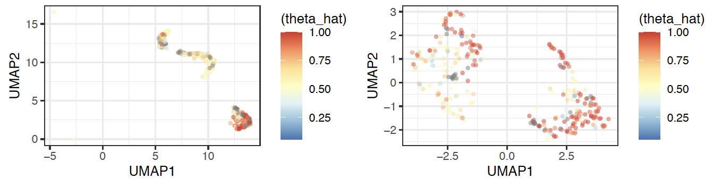

Alleloscope (scATAC-seq)
================
Chi-Yun Wu, Zhang Lab, University of Pennsylvania

## Description
Alleloscope is able to profile allele-specific copy number alterations (DNA-level information) for each cell in the scATAC-seq data (typically used to detect chromatin accessibility). This facilitates 1. integration of allele-specific copy number alterations and chromatin accessibility for individual cells and 2. more reliably detection of copy number events with allelic imbalance.

For more information about the method, please check out the [github](https://github.com/seasoncloud/Alleloscope) and the [paper](https://doi.org/10.1101/2020.10.23.349407).
<br/>

## Prepare input files
The following are the input files for different steps.

1. A Standard vcf file with the SNP info. [EXAMPLE](https://github.com/seasoncloud/Alleloscope/blob/main/data-raw/SNU601/scDNA/var_all_sub.vcf)
* GATK HaplotypeCaller (https://gatk.broadinstitute.org/hc/en-us/articles/360037225632-HaplotypeCaller) is recommended to use to call germline SNPs from the standard bam files. Other SNP calling tools such as BCFtools can also be used. 
* SNPs are recommended to be called from the bam file of the matched normal samples. Without matched normal samples, our results show that calling SNPs from the tumor/cellline sample itself can also work. 
<br/>
 
2. A tsv file with all cell barcodes. [EXAMPLE](https://github.com/seasoncloud/Alleloscope/blob/main/data-raw/SNU601/scDNA/barcodes_sub.tsv)
* Each row is a barcode indicating cell identity.
* The "barcodes.tsv" files are the standard outputs of the Cell Ranger software.
<br/>
 
3. SNP by cell (sparse) matrices for both reference allele and alternative alleles. [EXAMPLE](https://github.com/seasoncloud/Alleloscope/blob/main/data-raw/SNU601/scDNA/alt_all_sub.mtx) 
* For single-cell platforms using barcode technology with all reads in a single bam file, the VarTrix (https://github.com/10XGenomics/vartrix) tools can be used to generate SNP by cell matrices for both ref and alt alleles.
* For single-cell platforms with separate bam files, the two matrices can be directly generated from multi-sample vcf files.
* The information for each SNP should be in the vcf file, the labeling for each cell should be in the barcodes.tsv file (with the same order).
<br/>
  
4. Bin by cell (sparse) matrices for tumor samples. [EXAMPLE](https://github.com/seasoncloud/Alleloscope/blob/main/data-raw/SNU601/scDNA/tumor_sub.txt) 
* The values in the matrices represent total read counts for each cell in each bin.
* Row name format:"chr1-1-20000"; The order of the columns (Each column is a cell.) should be the same as that in the barcodes.tsv.
* For scATAC-seq data, peak by cell matrix can be converted to bin by cell matrix by summing up the signals. 
<br/>

5. Matrix for segmentation results from scDNA-seq or bulk WGS/WES. [EXAMPLE](https://github.com/seasoncloud/Alleloscope/blob/main/data-raw/SU008/scATAC/seg_table_WES.rds) 
* The matrix can be generated using the Step2. in the [tutorial](https://github.com/seasoncloud/Alleloscope/tree/main/samples/SNU601/scDNA).
<br/>

## Tutorial for scATAC-seq data
* Here is an example application to the SU008 scATAC-seq dataset (pre-treatment) from Satpathy et al., 2019. 
<br/>

#### Step0. Load the input files

* In R, set up the environment and read common files
```
library(Alleloscope) # load the library
setwd(~/Alleloscope/) # set path to the github folder

dir_path <- "./samples/SU008/scATAC/output/"; dir.create(dir_path) # set up output directory

size=read.table("data-raw/sizes.cellranger-atac-hg19-1.2.0.txt", stringsAsFactors = F) # read size file
```

* Read example files
```
# SNP by cell matrices for ref and alt alleles
barcodes=read.table("data-raw/SU008/scATAC/barcodes.tsv", sep='\t', stringsAsFactors = F, header=F)
alt_all=readMM("data-raw/SU008/scATAC/alt_all.mtx")
ref_all=readMM("data-raw/SU008/scATAC/ref_all.mtx")
var_all=read.table("data-raw/SU008/scATAC/var_all.vcf", header = F, sep='\t', stringsAsFactors = F)

# bin by cell matrices for tumor and normal for segmentation
raw_counts=read.table('data-raw/SU008/scATAC/chr200k_fragments_sub.txt', sep='\t', header=T, row.names = 1,stringsAsFactors = F)
```

* Read known cell identity (from peaks) (optional)
```
cell_type=readRDS('data-raw/SU008/scATAC/cell_type_from_peaks.rds')
```
<br/>

#### Step1. Creating a Alleloscope object for the analysis

* First, create a Alleloscope obj
```
Obj=Createobj(alt_all =alt_all, ref_all = ref_all, var_all = var_all ,samplename='Sample', genome_assembly="GRCh37", dir_path=dir_path, barcodes=barcodes, size=size, assay='scATACseq')
```

* Filter out cells and SNPs with too few read counts
```
Obj_filtered=Matrix_filter(Obj=Obj, cell_filter=5, SNP_filter=5, min_vaf = 0.1, max_vaf = 0.9) 

# suggest setting min_vaf=0.1 and max_vaf=0.9 when SNPs are called in the tumor sample for higher confident SNPs
```
<br/>

#### Step2. Unbiased segmentation based on matched WES/WGS data

* Load the segmentation results of the matched WES data from Yost et al., 2019.
```
Obj_filtered$seg_table=readRDS("./data-raw/SU008/scATAC/seg_table_WES.rds")
```

* Filter segments based on the numbers of SNPs.
```
Obj_filtered=Segments_filter(Obj_filtered=Obj_filtered, nSNP=500)
```
<br/>

#### Step3. Estimate cell major haplotype proportion for each region

* Estimate theta_hat of each cell for each region in the filtered segment table (seg_table_filtered).
```
Obj_filtered=Est_regions(Obj_filtered = Obj_filtered, max_nSNP = 30000, plot_stat = T,cont = TRUE)

# Recommend max_nSNP <50000
# Regions without allelic imbalence do not coverge (Reach the max number of iterations.)
```
<br/>

#### Step4. Identify/ Assign normal cells and diploid regions

* Assign a "normal region" from bulk DNA-seq to current scATAC-seq object.
```
Obj_filtered$ref=Obj_filtered$seg_table_filtered$chrr[7] # choose one normal region
```

* Assign "normal cells" from scATAC-seq genome-wide peak signals.
```
Obj_filtered$select_normal$barcode_normal=cell_type[which(cell_type[,2]!='tumor'),1]
```
<br/>

#### Step5. Genotype each cell in each region

* Estimate cell-specific (rho_hat, theta_hat) values for each region.
```
Obj_filtered=Genotype_value(Obj_filtered = Obj_filtered, type='tumor', raw_counts=raw_counts, cov_adj=1)  # for tumor
```

* Genotype all cells and generate a genotype plot for each region.
```
Obj_filtered=Genotype(Obj_filtered = Obj_filtered, cell_type=cell_type, xmax=3)
```


<br/><br/>

#### Step6. Construct lineage structure using cell major haplotype proportions for each cell across all regions

* Generate lineage tree based on cell-specific genotypes across the regions.
```
tmp=Select_normal(Obj_filtered = Obj_filtered, raw_counts=raw_counts, plot_theta = TRUE, cell_type = cell_type)
rm(tmp)
```
The output clustering result for the example regions is shown below.


<br/><br/>

## Potential downstream analysis 

#### Integrate allele-specific CNAs and chromatin accessibility at the single-cell level

* Perform UMAP projection using genome-wide peak profile on the tumor cells.
```
umap_peak=readRDS("./data-raw/SU008/scATAC/peak_umap_tumor.rds")
```

* Integrate allele-specific CNAs and peak signals for each cell in the scATAC-seq data.
* Using the CNA on chromosome 4 as an example.
```
theta_hat_chr4=Obj_filtered$rds_list$`chr4:0`$theta_hat
theta_hat_chr4=theta_hat_chr4[match(rownames(umap_peak), names(theta_hat_chr4))]
umap_peak$theta_hat=theta_hat_chr4
```
The two signals can be visuzlized simultaneously for each cell in the scATAC-seq data. 
```
library(ggplot2)
library(RColorBrewer)
# UMAP
pp=ggplot(umap_peak,aes(x = UMAP1, y=UMAP2)) +
  geom_point(size=1,alpha=0.5, aes(color=(theta_hat))) +
  scale_color_gradientn(colors = colorRampPalette(rev(brewer.pal(n = 7, name ="RdYlBu")))(100))+
  theme_bw()
print(pp)

# density plot
pd <-ggplot(umap_peak, aes(x=theta_hat, color=peak_group)) +
  geom_density()+
  scale_color_manual(values = c("peak2" = "#F8766D","peak1" = "#00BFC4")) +
  theme_bw()
print(pd)
```


<br/>

## Citation
Wu, C.-Y. et al. Alleloscope: Integrative analysis of single cell haplotype-divergent copy number alterations and chromatin accessibility changes reveals novel clonal architecture of cancers. bioRxiv (2020): [https://doi.org/10.1101/2020.10.23.349407](https://doi.org/10.1101/2020.10.23.349407)


[Back to the main page](https://github.com/seasoncloud/Alleloscope)

